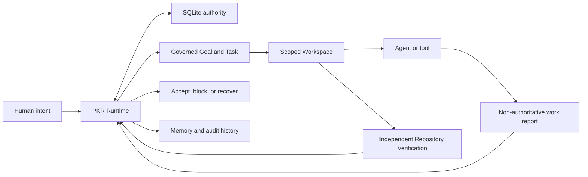

# PKR

PKR (Project Kernel Runtime, initially Project Knowledge Runtime) is an open
framework and project Runtime for AI-native software projects.

PKR does not help an AI write code. It gives humans, agents, tools, and
workflows one shared set of project rules and one authoritative project state.
The repository is one source of artifacts in that runtime, not the runtime
itself.

PKR is built around project contracts, not a particular model vendor, Agent
host, CLI, or execution service. Optional host-specific notes belong under
`docs/integrations/`. The source is licensed under
[Apache-2.0](LICENSE); the package remains private and is not published to npm.

Contribution changes are checked by the [CI workflow](.github/workflows/ci.yml)
on Windows and Ubuntu. See [CONTRIBUTING.md](CONTRIBUTING.md) for the local and
product-level verification paths, and [SECURITY.md](SECURITY.md) for private
vulnerability reporting and the v1 trusted-host boundary.

PKR provides policy, evidence, timeout, size, and path controls. It is not an
OS sandbox, credential vault, or guarantee that trusted host processes cannot
damage the local machine. See the [threat model](docs/security/threat-model.md),
[privacy and diagnostics policy](docs/security/privacy-and-diagnostics.md), and
[operational limits](docs/operations/limits.md).

## How PKR works



PKR governs the project around the AI work. It does not choose a model or write
the code itself. SQLite records project truth; participants receive bounded
work, report what they attempted, and cannot mark their own result accepted.

## Three-command entry

The npm package is not published, so the current entry uses a built source
checkout:

```powershell
node dist/cli.js init --project C:\path\to\repo `
  --name demo --outcome "Deliver one independently verified change"
node dist/cli.js run --project C:\path\to\repo `
  --request "Prepare one bounded repository change"
node dist/cli.js status --project C:\path\to\repo
```

- `init` creates the local SQLite authority for an existing Git repository.
- `run` records governed Goal/Task state and returns claim-ready work; it does
  not invoke a model or claim completion.
- `status` reopens the Runtime and reports the persisted authoritative state.

Continue with the full claim, submit, independent Verification, and recovery
path below. See [the architecture](docs/architecture.md) for the authority and
evidence boundaries.
For the product rationale, see [Why PKR](docs/product-overview.md).

For an explicitly configured, recoverable drive loop over an existing governed
Task, use [the Runtime and Supervisor guide](docs/runtime-guide.md). The
Supervisor is optional liveness infrastructure; it does not select Providers,
approve protected decisions, or replace independent Verification.

## 5-minute source path

This is the smallest real repository flow after an Agent host has loaded PKR.
The loaded Agent claims work from PKR, edits the repository
directly, submits real Git evidence, and waits for independent Verification.
No external execution adapter is required. Run it from the PKR checkout with
Node 24+ and Git installed:

```powershell
$PkrRoot = (Get-Location).Path
$Target = Join-Path $env:TEMP "pkr-v1-quickstart"
New-Item -ItemType Directory -Force $Target | Out-Null
Set-Location $Target
git init -b main
Set-Content .gitignore ".pkr/"
Set-Content README.md "# PKR v1 target"
git add .
git -c user.name="PKR Quickstart" -c user.email="pkr@example.invalid" commit -m baseline

$Pkr = Join-Path $PkrRoot "dist\cli.js"
node $Pkr init --project $Target --name quickstart --outcome "Run one governed local task"
node $Pkr setup --project $Target --quickstart
node $Pkr doctor --project $Target
$Intake = node $Pkr steward apply --project $Target --request "Produce one quickstart result" | ConvertFrom-Json
$Agent = node $Pkr agent register --project $Target --name current-agent --host local | ConvertFrom-Json
$AgentId = $Agent.value.metadata.id
$Claim = node $Pkr lps claim --project $Target --task $Intake.taskId --agent $AgentId `
  --session-locator "agent-host://current-session" | ConvertFrom-Json
node -e "require('node:fs').mkdirSync('src',{recursive:true});require('node:fs').writeFileSync('src/pkr-quickstart-result.txt','PKR quickstart work completed\n')"
node $Pkr lps submit --project $Target --assignment $Claim.assignmentId --agent $AgentId --outcome partial
node $Pkr verify --project $Target --task $Intake.taskId --assignment $Claim.assignmentId
node $Pkr status --project $Target
node $Pkr lps board --project $Target
```

The shell write above stands in for the already loaded Agent editing the real
repository. `lps submit` records a non-authoritative work report and before/after
Git evidence; only the independent Verification command creates acceptance.
The session locator is correlation metadata, not Agent identity or authority.

`setup --quickstart` is a controlled file initializer for repositories that have
already run `pkr init`. It copies only the example Verification plan and script
into `.pkr/`; it never enables or copies an optional execution Adapter. These
quickstart Verification files are demonstration fixtures for this walkthrough,
not production acceptance standards. Replace them with project-specific checks
before relying on Verification for a real release.

## Zero-to-one Project Manager slice

The first Project Manager entry can clarify a request before creating anything,
prepare a digest-bound proposal, and bootstrap a new Git/PKR project only after
an explicit human approval:

```powershell
$Target = Join-Path $env:TEMP "story-editor"
$Intake = node $Pkr project intake `
  --request "Build a playable interactive movie editor" `
  --name story-editor `
  --outcome "Deliver one playable and independently verified editor slice" `
  --audience "independent narrative game creators" `
  --target $Target | ConvertFrom-Json
$Intake.proposal | ConvertTo-Json -Depth 20 | Set-Content -Encoding utf8 proposal.json
node $Pkr project bootstrap --proposal-file proposal.json --approve-by human_owner
node $Pkr project plan --project $Target
node $Pkr project status --project $Target
```

Calling `project intake` with missing fields returns a digest-bound optional
`QuestionSheet` and performs no filesystem or Runtime mutation. Every answer is
optional and carries a preselected recommendation. The caller can change only
the answers it disagrees with, accept all recommendations, or skip the whole
sheet:

```powershell
node $Pkr project intake --request "Build a playable editor"
node $Pkr project intake --request "Build a playable editor" --question-format chat
node $Pkr project intake --request "Build a playable editor" --question-format cli
node $Pkr project intake --request "Build a playable editor" --accept-recommended
node $Pkr project intake --request "Build a playable editor" --skip-questions
```

`--answers-file` accepts either a direct answer object or a structured
`{"action":"submit","answers":{...}}` response. Skipping ordinary intake
questions uses their declared recommendations and records the sheet and
resolution digests in the proposal. Protected Steward questions are emitted
only for material critical forks. They remain optional to answer, but skipping
them records the protected action as blocked; it never counts as approval.
The `steward propose` CLI persists this clarification state so an interrupted
conversation can resume it after restart; rendering the returned sheet remains
read-only.
`steward apply` still requires the explicit Project owner approval enforced by
the Runtime path.

Question semantics are shared across surfaces, while presentation is selected
per surface. `chat` renders a sectioned Markdown sheet for conversational
Agents; `cli` renders a compact terminal sheet. A renderer is read-only and
cannot change question materiality, recommendations, or protected skip rules.
The same profiles are available through the TypeScript API as
`CHAT_MARKDOWN_PROFILE` and `CLI_COMPACT_PROFILE`.

Questioning is not limited to project bootstrap. PKR maintains an independent
clarification state machine for Steward requests, Goal reviews, decision forks,
and execution checkpoints. Each assessment enters `assessing` and then moves
to `no-question-needed`, `awaiting-answers`, or `blocked`; answered sheets move
to `resolved`, while a newer context supersedes an unfinished run. The state is
stored as a namespaced `WorkflowRun` in SQLite and survives process restart.
Before a Runtime exists, project intake labels the sheet `pre-runtime`; its
sheet and resolution digests are carried into the later bootstrap proposal.

```powershell
$Session = node $Pkr clarification assess --project $Target `
  --subject-kind Goal --subject-id goal_001 --subject-revision 1 `
  --trigger goal-review --intent "Improve this goal as needed" | ConvertFrom-Json

node $Pkr clarification status --project $Target `
  --run $Session.runId --question-format chat

node $Pkr clarification respond --project $Target `
  --run $Session.runId --accept-recommended
```

Agents may submit explicit ambiguity signals through `--signals-file`; the
Runtime decides from those signals whether a question is needed. Clear inputs
record `no-question-needed` without presenting a sheet. Vague goals receive a
safe, reversible recommendation. Protected decisions remain blocked when
skipped or when their recommendation is merely accepted; only an explicit
approved answer plus the existing owner approval can authorize the later
project mutation. `steward propose` runs this assessment automatically.

Bootstrap requires a
new target path, creates a real Git commit and PKR SQLite authority, and records
the Mission, Goal, backlog Tasks, owner Decision, and a fail-closed Verification
placeholder. Without `--verification-file`, the placeholder always exits non-zero
and bootstrap reports `initialized_claim_ready`: the loaded Agent may plan and
claim, while acceptance remains blocked. `pkr doctor` remains not ready until the
owner installs a product-specific Verification Plan. Monthly and rolling-day Tasks carry digest-bound proposal and
approval provenance; the rebuildable plan reads those markers from SQLite rather
than interpreting Task titles. This slice does not yet choose Agents, configure
remote Workers, automatically assign Agents, authenticate the supplied human
identity, or adapt plans from execution history. External work reports still
cannot create acceptance.

## Status

PKR **v1.2.0** is the current stable GitHub source release of the local reference
Runtime and its accepted compatibility contract. It includes governed Steward
intake, Agent-native work claiming and submission, independent Repository
Verification, separate Runtime acceptance, recovery, provenance-aware Memory,
portable Workflows, atomic Packages, two starter project Profiles, and
content-addressed RepositoryEvidence with reviewed shareable projections. An
optional, explicitly configured Provider-neutral Supervisor can drive one
governed reconciliation action at a time without changing those authority
boundaries. The npm package remains private and unpublished. Hosted deployment,
a package registry, and production Agent-host integrations are not claimed.

The public [specification index](specs/README.md) organizes the complete v0.1 to
v1.2 evolution: the v0.2-v0.4 Draft RFCs, implemented v0.5-v0.6 milestones,
public v0.7 Alpha, integrated v0.8-v0.9 stages, and stable v1.0-v1.2 source
releases. It links each version to its schemas, companion contracts, and release
status. Draft publication, milestone verification, and stable release
acceptance are deliberately separate.

## Current boundary

The accepted **v1 stable surface** is listed in the
[stable contract](docs/release/v1-stable-contract.md). It covers the local
Runtime, Steward and Agent-native LPS flow, authoritative state, work reports,
Repository Verification, Runtime acceptance, recovery, Memory, declarative
Workflows, project Profiles, and atomic Package lifecycle.

Governed evolution, Metrics, managed Prompts and Policies, and optional
execution integrations ship as explicitly experimental surfaces outside the v1
compatibility promise. Hosted deployment, a package registry, production model
integrations, an OS sandbox, and a production SLA remain out of scope.

## Operating model

- **PKR Kernel** owns authoritative state, permissions, policy, events,
  evidence, projections, and recovery semantics.
- **Project Steward** is the governed conversational entry point for a human. It
  prepares proposals and requests approval; it is not a root bypass.
- **LPS** is the reference orchestrator. It plans, dispatches, monitors, and
  absorbs callbacks from PKR state without creating a second source of truth.
- **Agents and tools** participate through bounded Workspaces and work reports;
  optional integrations never own project truth or acceptance.

See the [core architecture](docs/architecture.md) for the generic authority and
evidence flow. Brand-specific host examples are optional integrations, never a
Runtime dependency.

The first product proof is a new Git repository flow from `pkr init`, through
one Steward request and LPS dispatch, to independently verified Task
completion, process restart, Memory-based context reconstruction, and one
governed improvement proposal.

## Design principles

1. A project has one authoritative runtime state.
2. Every mutation is attributable, authorized, and explainable.
3. `Done` means required verification passed, not merely that work stopped.
4. Agents consume a task-scoped workspace projection, not the entire repository.
5. Packages extend the core object model without redefining it.
6. Orchestrator boards and Memory indexes are rebuildable projections, never a
   second project authority.
7. Self-evolution creates versioned proposals that pass the same governance,
   verification, promotion, and rollback rules as other material changes.

## Validate the specification

With Python 3.11 and the dependencies in `conformance/requirements.txt`:

```powershell
py -3.11 -B conformance/validate_core_schema.py
py -3.11 -B conformance/validate_bootstrap_schema.py
py -3.11 -B conformance/validate_runtime_schema.py
py -3.11 -B conformance/validate_coordination_schema.py
py -3.11 -B conformance/validate_coordination_semantics.py
```

The runners check both schema meta-models, valid fixtures for every core and
control-record kind, and targeted invalid fixtures. They do not claim to
perform POM graph, lifecycle, authentication, or transaction validation.

The v0.4 coordination validators add structural coverage for Workflow, Agent,
Workspace, Memory, Package, and coordination protocol records plus an in-memory
semantic harness. They do not claim to prove durable Runtime persistence.

## Source installation

The supported v1 environment is Node 24.x, Python 3.11, and Git on
Windows or Ubuntu. Install from a source checkout; there is no supported
`npm install <registry-name>` path because PKR is not published to npm:

```powershell
npm ci
py -3.11 -m pip install --requirement conformance/requirements.txt
npm run verify
npm run build
node dist/cli.js doctor --project C:\path\to\project
node dist/cli.js init --project C:\path\to\project --name my-project
node dist/cli.js status --project C:\path\to\project
node dist/cli.js run --project C:\path\to\project --request "Build one bounded feature"
node dist/cli.js steward apply --project C:\path\to\project --request "Build one bounded feature"
node dist/cli.js lps board --project C:\path\to\project
node dist/cli.js memory list --project C:\path\to\project
node dist/cli.js profile list --project C:\path\to\project
```

On Ubuntu, use `python -m pip ...`. On Windows, `py -3.11 -m pip ...` avoids
the Windows Store `python` alias when the Python launcher is installed.

For a local packed-artifact test, run `npm pack --dry-run --json`, then
`npm pack --json` and install the resulting `.tgz` by file path in a disposable
directory. `npm run check:fresh-install` automates both a fresh source build and
that local tarball smoke test without publishing anything.

The Runtime stores authority in `.pkr/runtime.sqlite` and rebuilds inspectable
JSON under `.pkr/projections/`. Projection files are never mutation input. See
[Decision 0001](docs/decisions/0001-reference-runtime-layout.md) for the storage
and dependency boundary.

`pkr run` is the one-line request entry point for an initialized repository. It
returns a machine-readable Task card with `goalId`, `taskId`, and the Task's
`backlog` phase. The card marks `claim`, `submit`, and independent `verify` as
the next steps; it does not run an Agent, write code, or create Verification or
acceptance. Requests that affect architecture, security, permissions,
credentials, privacy, release, or compatibility require the project owner to
approve explicitly:

```powershell
node dist/cli.js run --project C:\path\to\project `
  --request "Change the public API compatibility policy" --approve-by human_001
```

Without `--approve-by <owner-id>`, a material request fails closed with the
existing CLI error contract.

The [LPS adapter mapping](docs/integrations/lps.md) explains how worker, gate,
callback, and board state are derived from PKR without becoming a second truth.

### Repository-native verification

An Agent, tool, or Adapter callback is a non-authoritative work report, even when its
protocol outcome is `verified`. A successful submission moves the Task only to
`verifying`; it never creates acceptance.

The default LPS path is pull-based and Agent-native:

1. the already loaded Agent registers an Agent record;
2. `lps claim` creates or reuses Assignment, AgentSession, Lease, and Workspace;
3. that Agent edits the repository directly using its existing host tools;
4. `lps submit` collects current Git evidence and records the work report;
5. an independent `verify` command alone may create acceptance.

The optional local-process integration remains experimental and is not required
for the Agent-native path. Its process protocol, compatibility identifiers, and
additional trust boundaries live only in the
[LPS integration document](docs/integrations/lps.md).

By default `pkr doctor` runs the read-only `pkr.preflight/v1` checks for Node
24+, the exact Git root and HEAD, readable PKR Runtime state, Agent-native pull
conditions, Verification configuration, and Verification executable resolution.
Optional Adapter configuration is neither loaded nor required. Use `--adapter`
to add executable and active Adapter-binding checks:

```powershell
node dist/cli.js doctor --project C:\path\to\project
node dist/cli.js doctor --adapter --project C:\path\to\project
```

Exit code `0` means every required check passed; exit code `2` means the JSON
report has `ready: false` with stable `fail` or `blocked` codes. A dirty Git
working tree is reported but is not itself a readiness failure. Doctor does not
create Tasks or Assignments, execute Agent, Adapter, or Verification commands,
or mutate authoritative Runtime state. Executable resolution proves
only that a file can be resolved, not that it is trusted or will succeed.

The repository Verifier loads `.pkr/verification.json`, collects the current Git
HEAD, status, staged and unstaged diff, and changed-file set, then independently
runs the declared commands. Commands are structured executable/argument arrays,
not shell strings. A minimal plan is:

```json
{
  "version": "pkr.verify/v1",
  "commands": [
    {
      "id": "tests",
      "executable": "node",
      "args": ["--test"],
      "timeoutMs": 120000
    }
  ],
  "allowedPaths": ["src/**", "test/**"],
  "forbiddenPaths": [".github/**"],
  "requireChanges": true
}
```

The CLI exposes the Agent-native claim/submit loop and the formal verification
step:

```powershell
node dist/cli.js lps claim --project C:\path\to\project `
  --task <task-id> --agent <agent-id> --session-locator "agent-host://current-session"
# The loaded Agent edits the repository directly here.
node dist/cli.js lps submit --project C:\path\to\project `
  --assignment <assignment-id> --agent <agent-id> --outcome partial
node dist/cli.js verify --project C:\path\to\project `
  --task <task-id> --assignment <assignment-id>
```

Runtime acceptance requires this formal evidence, recomputes its repository
digest, path-scope result, command result, and final verdict, and rejects the
Agent that produced the work result from acting as Verifier. Failed
verification preserves the Artifact and failed Verification while blocking the
Task; it does not create an acceptance Verification.

The stable v1 Runtime also exposes `memory derive|list|promote`,
`profile install|list`, `workflow start|transition`, and
`package uninstall|rollback`. Memory entries are derived from exact source
revisions and become persistently invalid when those sources change. Profile
Packages contribute declarative Workflow definitions; they cannot execute
code, access time or network state, or mutate POM lifecycle state.

Experimental v1 surfaces include `metric record`,
`evolution propose|observe|revise|approve|evaluate`, and
`evolution external-evaluate|promote|status`. They currently normalize repeated
Assignment failures, failed or waived Verification debt, breached Metrics, and
attributed human feedback into inactive candidates. Workflow Profiles, managed
Prompt Knowledge, and governance Policy Constraints now have target-specific
deterministic canaries, atomic activation, status, and rollback. Policy
evolution requires a deny-by-default decision table that preserves owner
approval, immutable audit, Verification, rollback, and protected core scope.
Managed Adapter Artifacts add isolated callback conformance replay and bind the
active Adapter identity, version, capabilities, CapabilityStatement,
AgentSession, and live callback contract. Candidate, observation, Policy,
Adapter, and external-result JSON may be supplied inline or from files. Runtime
candidates use the fail-closed external-evaluation boundary. Adapter activation
does not hot-swap an integration binary; the host must supply the exact active
version. These commands remain outside the accepted stable compatibility
promise and cannot weaken Repository Verification or Runtime acceptance.

```powershell
node dist/cli.js metric record --project C:\path\to\project `
  --measure "Canary failure rate" --source pkr/local --window P7D `
  --operator lte --threshold 0.1 --severity error --value 0.25

node dist/cli.js evolution observe --project C:\path\to\project `
  --candidate-file .pkr\candidate.json --observation-file .pkr\observation.json `
  --proposer agent_steward_001

node dist/cli.js prompt register --project C:\path\to\project `
  --title "Agent execution prompt" --template-file .pkr\prompt.txt --version 1.0.0

node dist/cli.js policy register --project C:\path\to\project `
  --policy-file .pkr\governance-policy.json

node dist/cli.js adapter register --project C:\path\to\project `
  --adapter-file .pkr\local-process-adapter.json
```

## Repository layout

- `src/`: TypeScript reference Runtime, CLI, adapters, and tests.
- `specs/`: indexed, versioned specification and RFC documents.
- `schemas/`: machine-readable JSON Schema contracts by protocol version.
- `conformance/`: Python validators and positive/negative fixtures.
- `scripts/`: generation and architectural-boundary checks.
- `docs/`: durable architecture decisions, integrations, and repository policy.
- `iterations/`: non-authoritative plans and delivery evidence.
- `dist/`: generated TypeScript output; ignored and safe to regenerate.
- `release/`: independent public-release repository; ignored by this repository.

For a clean local setup, use `npm ci`. Run `npm run build` for the fast
TypeScript and dependency-boundary check, `npm test` for Runtime regressions,
and `npm run verify` for the complete generation, schema, build, and test gate.

## Repository model

This checkout is the public source-release repository. Public `main`, signed or
annotated release tags, and GitHub Release metadata define its published state.
Private development records and the historical local `release/` staging path
are not public truth. See
[the development and release policy](docs/repository-model.md).

The public product model is summarized in the
[framework overview](docs/product-framework.md) and
[architecture](docs/architecture.md). The accepted stable contract and its
release gate record live in the
[v1 stable contract](docs/release/v1-stable-contract.md) and
[v1 blocker register](docs/release/v1.0-blockers.md).

## v1.2.0 release status

This checkout is installable from source or as a local tarball after
`npm run build`. Source, package metadata, `LICENSE`, `NOTICE`, and third-party
notices are aligned to Apache-2.0, while `package.json` deliberately retains
`private: true` and version `1.2.0`. The supported distribution is the GitHub
source release; npm publication is not authorized.

The exact contract, gate results, release checks, and owner decisions are in the
[v1 stable-contract inventory](docs/release/v1-stable-contract.md),
[gate register](docs/release/v1.0-blockers.md),
[v1.2 release checklist](docs/release/v1.2-candidate-checklist.md), and
[owner review](docs/release/v1-owner-review.md). See the
[v1.2.0 release notes](docs/release/v1.2.0.md) for the current shipped scope and
boundaries.
