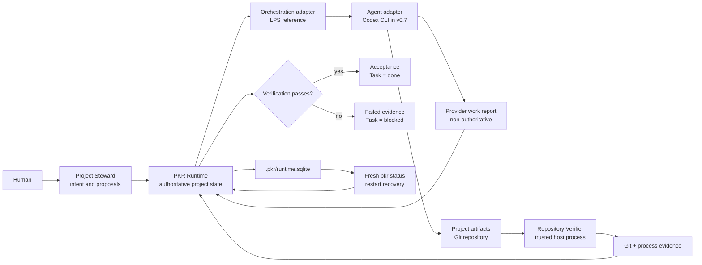
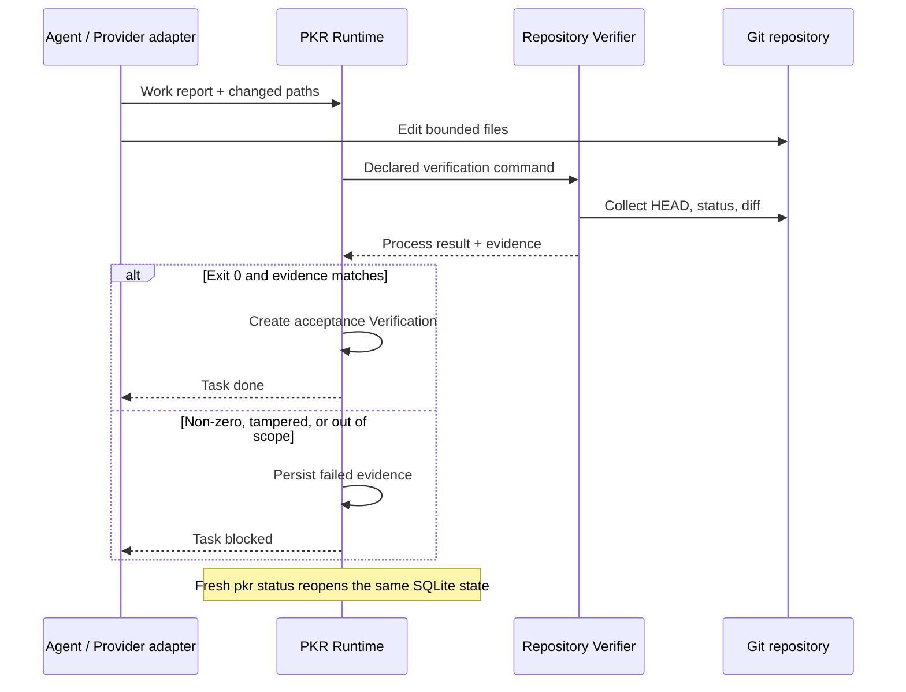

# PKR

**PKR (Project Kernel Runtime) is an open project Runtime for AI-native software
development.** It gives humans, Agents, tools, and workflows one authoritative
project state and one governed way to plan, execute, verify, recover, and evolve
work.

Software projects otherwise scatter intent, decisions, tasks, memory,
permissions, workflow state, and proof across repository files, conversations,
provider dashboards, and CI. PKR makes that operating state explicit. It does
not own code generation; it owns the rules by which the project keeps running.

PKR v0.7.0-alpha.1 is a public, pre-stable local reference implementation. It
currently ships one Provider adapter for the Codex CLI. Hosted deployment,
additional cloud Provider adapters, automatic model selection, and v0.8/v0.9
evolution features are outside this release.

See [Why PKR and the current boundary](docs/product-overview.md) for the short
product explanation, and [the alpha release notes](docs/releases/v0.7.0-alpha.1.md)
for the evidence-backed release boundary.

[Verify CI](https://github.com/locooooooooo/PKR/actions/workflows/verify.yml) |
[v0.7.0-alpha.1 release](https://github.com/locooooooooo/PKR/releases/tag/v0.7.0-alpha.1)

## 30-second path

Run these three commands against an existing Git repository:

```shell
pkr init --project /path/to/project --name my-project
pkr run "Add one bounded feature" --project /path/to/project --verify "npm test"
pkr status --project /path/to/project
```

| Command | What the real result means |
| --- | --- |
| `pkr init` | Creates `.pkr/runtime.sqlite` and rebuildable projections in the target repository. |
| `pkr run ... --verify ...` | Records one Assignment, asks local Codex to work, then runs the declared Repository Verifier. |
| `pkr status` | Opens persisted state in a fresh process and reports task, callback, and evidence state. |

Install from source first:

```shell
git clone https://github.com/locooooooooo/PKR.git
cd PKR
npm ci
npm run build
npm link
```

This requires Node.js 24 or newer, Git, and Python 3.11 or newer. `pkr run`
also requires an installed and authenticated `codex` CLI. The
`pkr-runtime@0.7.0-alpha.1` package is **not published to npm**; use the source
install until a separately authenticated npm release is completed.

## Architecture at a glance



## What counts as done

The authority boundary is deliberate:

1. **Provider work report:** the Provider submits a non-authoritative work report and repository-change
   declaration. Even a callback that says `verified` cannot complete a Task.
2. **Repository Verification:** the Repository Verifier records structured process results and Git HEAD,
   status, diff, staged diff, and changed paths in digest-bound evidence.
3. **Runtime acceptance:** the Runtime re-collects current Git evidence, recomputes the plan, scope,
   command, and final verdict, and only then creates test and acceptance
   Verification records.
4. A non-zero verification exit persists failed evidence and leaves the Task
   blocked. It never creates acceptance.

Provider and verification commands run as trusted host processes with the
current user's filesystem, network, and credential access. PKR enforces its
authority and evidence boundary, but v0.7 does **not** provide an OS sandbox.

## One run, two outcomes



## Reproducible proof

The checked-in [three-command demo](examples/three-command-demo/README.md)
creates a temporary Git repository, asks a real authenticated Codex CLI to make
one small change, verifies it, and reopens status in a fresh process:

```shell
npm run build
node scripts/run-three-command-demo.mjs
```

The failure path is equally explicit and leaves a durable blocked Task before
reopening status:

```shell
node scripts/run-three-command-demo.mjs --case blocked
```

Both cases use a real authenticated Codex CLI. CI uses a fake Codex executable
for deterministic orchestration tests; those tests do not claim model quality
or a real user environment. The real Codex demo is optional and is not run in
CI.

## Validate the public tree

One canonical command runs generated-artifact checks, all Python conformance
validators, the Runtime tests, and the public alpha regressions:

```shell
npm run verify
npm run check:package
node scripts/check-public-tree.mjs
git diff --check
```

`npm run verify:schemas` selects Python 3.11 or newer on Windows and Linux. The
GitHub Actions workflow runs the same commands on both `ubuntu-latest` and
`windows-latest`.

The conformance runners check schema meta-models, valid fixtures for every core
and control-record kind, and targeted invalid fixtures. They do not claim to
prove authentication or all POM graph and lifecycle semantics.

## Operating model

- **PKR Kernel** owns authoritative state, permissions, policy, events,
  evidence, projections, and recovery semantics.
- **Project Steward** prepares governed intake and approval requests; it is not
  a root bypass.
- **LPS** plans, dispatches, monitors, and absorbs callbacks from PKR state
  without creating a second source of truth.
- **Provider adapters** translate external execution into proposals, results,
  logs, and artifact declarations. They do not issue acceptance.
- **Repository Verifier** executes the declared host command and gathers the
  Git and process evidence that Runtime acceptance requires.

The Runtime stores authority in `.pkr/runtime.sqlite`; files under
`.pkr/projections/` are inspectable, rebuildable outputs and never mutation
input. See [Decision 0001](docs/decisions/0001-reference-runtime-layout.md) and
the [LPS adapter mapping](docs/integrations/lps.md).

## Current limits

PKR is not a cloud platform, hosted Agent service, OS sandbox, general-purpose
Agent marketplace, npm package release, or production-stability guarantee. It
does not provide cloud Provider adapters or automatic model selection. The
current alpha is a local reference Runtime with one Codex CLI adapter; future
RFCs are design material, not shipped capabilities.

## Deep design

Most users do not need these contracts for the three-command path. They define
the deeper object, protocol, and conformance design behind the v0.7 Runtime.

- [PKR v0.1 definition](specs/0000-pkr-v0.1.md)
- [PKR Object Model v0.2 draft](specs/0001-pkr-object-model-v0.2.md)
- [PKR Core Schema v0.2 draft](specs/0002-pkr-core-schema-v0.2.md)
- [PKR v0.2 JSON Schema](schemas/v0.2/pkr-object.schema.json)
- [PKR Manifest and Bootstrap v0.2 draft](specs/0003-pkr-manifest-bootstrap-v0.2.md)
- [PKR v0.2 Bootstrap Schema](schemas/v0.2/pkr-bootstrap.schema.json)
- [PKR Runtime Protocol v0.2 draft](specs/0004-pkr-runtime-protocol-v0.2.md)
- [PKR v0.2 Runtime Schema](schemas/v0.2/pkr-runtime.schema.json)
- [PKR Steward and LPS Boundary v0.3 draft](specs/0005-pkr-steward-lps-boundary-v0.3.md)
- [PKR Workflow and Verification Profile v0.3 draft](specs/0006-pkr-workflow-verification-v0.3.md)
- [PKR Agent Session Protocol v0.3 draft](specs/0007-pkr-agent-session-protocol-v0.3.md)
- [PKR Workspace and Memory v0.3 draft](specs/0008-pkr-workspace-memory-v0.3.md)
- [PKR Package and Governed Evolution v0.3 draft](specs/0009-pkr-package-evolution-v0.3.md)
- [PKR v0.4 Coordination Record and Action Catalog](specs/0010-pkr-v0.4-record-action-catalog.md)

This repository is the Apache-2.0 source and release tree for the v0.7 Runtime
and its specifications. It is not the obsolete spec-only staging repository.

## More detail

- [Why PKR and current limits](docs/product-overview.md)
- [Three-command demo](examples/three-command-demo/README.md)
- [Alpha release notes](docs/releases/v0.7.0-alpha.1.md)
- [Changelog](CHANGELOG.md)
- [Soak and audit format](soak/README.md)
- [Source and release boundary](docs/repository-model.md)
- [Contributing](CONTRIBUTING.md) - [Security](SECURITY.md) - [License](LICENSE)
