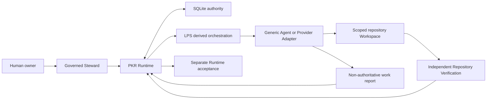

# PKR architecture

PKR is a Provider-neutral project framework and local reference Runtime. The
Runtime owns authoritative project state in SQLite. Agent hosts, Provider
Adapters, repository tools, and LPS are interchangeable boundaries around that
authority, not alternate control planes.

The four evidence layers are deliberately distinct:

1. SQLite records and ordered events are authoritative Runtime state.
2. Agent and Provider reports describe attempted work but cannot accept it.
3. Repository Verification recomputes live Git and command evidence.
4. Runtime acceptance is a separate guarded transition after Verification.

PKR constrains host execution with scopes, structured arguments, timeouts,
digests, and audit records. It is not an operating-system sandbox, container,
credential vault, hosted control plane, or production SLA. Brand-specific Agent
host examples may appear only in optional integration documents and do not
change these boundaries.
