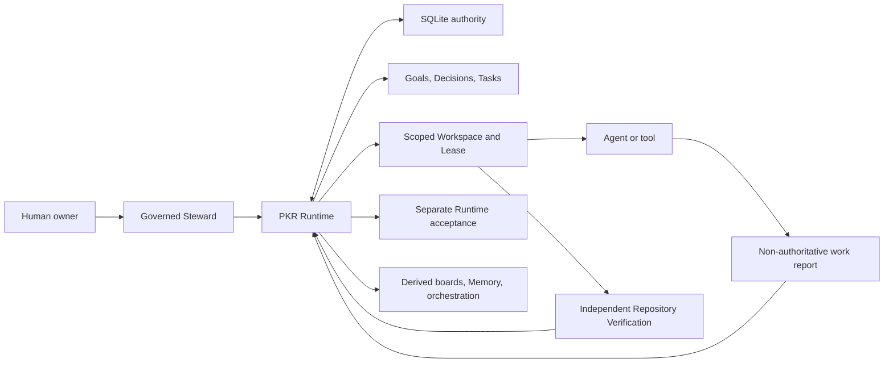

# PKR architecture

PKR is an AI-native project framework and local reference Runtime. It gives
humans, Agents, and tools one governed project model while SQLite remains the
authoritative state. External participants operate on bounded Workspaces; none
of them becomes a second control plane.

The four evidence layers are deliberately distinct:

1. SQLite records and ordered events are authoritative Runtime state.
2. Participant work reports describe attempted work but cannot accept it.
3. Repository Verification recomputes live Git and command evidence.
4. Runtime acceptance is a separate guarded transition after Verification.

PKR constrains host execution with scopes, structured arguments, timeouts,
digests, and audit records. It is not an operating-system sandbox, container,
credential vault, hosted control plane, or production SLA. Optional execution
Adapters and host-specific examples may appear in integration documents, but
they are not the framework architecture or a v1 compatibility requirement.
